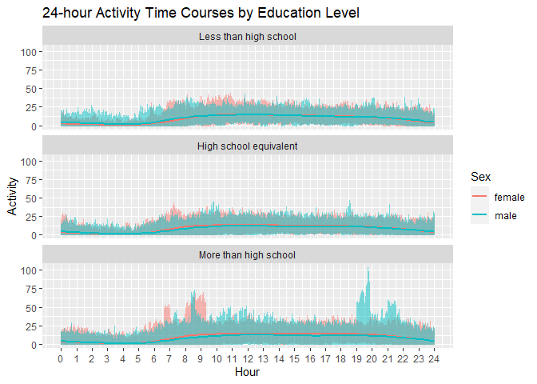

P8105_homework3
================
Danny Nguyen
2023-10-11

# Question 1

## Load dataset

``` r
library(p8105.datasets)
library(tidyverse)
```

    ## Warning: package 'tidyverse' was built under R version 4.2.3

    ## Warning: package 'tibble' was built under R version 4.2.3

    ## Warning: package 'readr' was built under R version 4.2.3

    ## Warning: package 'lubridate' was built under R version 4.2.3

    ## ── Attaching core tidyverse packages ──────────────────────── tidyverse 2.0.0 ──
    ## ✔ dplyr     1.1.0     ✔ readr     2.1.4
    ## ✔ forcats   1.0.0     ✔ stringr   1.5.0
    ## ✔ ggplot2   3.4.1     ✔ tibble    3.2.1
    ## ✔ lubridate 1.9.2     ✔ tidyr     1.3.0
    ## ✔ purrr     1.0.1     
    ## ── Conflicts ────────────────────────────────────────── tidyverse_conflicts() ──
    ## ✖ dplyr::filter() masks stats::filter()
    ## ✖ dplyr::lag()    masks stats::lag()
    ## ℹ Use the ]8;;http://conflicted.r-lib.org/conflicted package]8;; to force all conflicts to become errors

``` r
data("instacart")
```

Description: Dataset ‘instacart’ has 1384617 rows and 15 columns, which
makes it generally a large-sized dataset. This data is from an online
grocery service that allows you to shop online from local stores in NYC.
Some of its notable variables include identifiers (order,
product,customers), order_number (the order sequence number for this
user), order_dow (the day of the week on which the order was placed),
order_hour_of_day (the hour of the day on which the order was placed),
product_name (name of the product), etc.

## How many aisles are there, and which aisles are the most items ordered from?

``` r
instacart %>% 
  summarise(aisle=n_distinct(aisle_id))
```

    ## # A tibble: 1 × 1
    ##   aisle
    ##   <int>
    ## 1   134

There are 134 distinct aisles.

``` r
instacart %>%
  group_by(aisle_id)%>%
  summarise(sum=n())%>%
  arrange(desc(sum))
```

    ## # A tibble: 134 × 2
    ##    aisle_id    sum
    ##       <int>  <int>
    ##  1       83 150609
    ##  2       24 150473
    ##  3      123  78493
    ##  4      120  55240
    ##  5       21  41699
    ##  6      115  36617
    ##  7       84  32644
    ##  8      107  31269
    ##  9       91  26240
    ## 10      112  23635
    ## # … with 124 more rows

From this, aisle with id 83 (fresh vegetables) is the one with the most
items ordered from (150609 ordered items). Coming right after it, aisle
24 (fresh fruits) and aisle 123 (packaged vegetables fruits) are at 2nd
and 3rd places respectively.

## Make a plot that shows the number of items ordered in each aisle, limiting this to aisles with more than 10000 items ordered. Arrange aisles sensibly, and organize your plot so others can read it.

``` r
instacart %>%
  group_by(aisle)%>%
  summarise(num_items=n())%>%
  filter(num_items>10000)%>% 
  ggplot(aes(x= reorder(aisle, -num_items), y=num_items)) +
  geom_bar(stat="identity", fill="red4")+
  coord_flip()+
  labs(title = "Number of Ordered Items in Each Aisle",
       x = "Aisle Name",
       y = "Number of Ordered Items from Each Aisle") +
  theme_minimal()
```

<!-- --> This bar
graph shows number of ordered items in each aisle that is organized in
an ascending order.

## Make a table showing the three most popular items in each of the aisles “baking ingredients”, “dog food care”, and “packaged vegetables fruits”. Include the number of times each item is ordered in your table.

``` r
top3popular_items <- instacart %>%
  filter (aisle == "baking ingredients" | aisle == "dog food care" | aisle == "packaged vegetables fruits")%>%
  group_by(aisle, product_name)%>%
  summarise(num_items=n())%>% 
  arrange(aisle, desc(num_items))%>%
  group_by(aisle)%>%
  top_n(3)

knitr::kable(top3popular_items,caption = "Top 3 Popular Items")
```

| aisle                      | product_name                                  | num_items |
|:---------------------------|:----------------------------------------------|----------:|
| baking ingredients         | Light Brown Sugar                             |       499 |
| baking ingredients         | Pure Baking Soda                              |       387 |
| baking ingredients         | Cane Sugar                                    |       336 |
| dog food care              | Snack Sticks Chicken & Rice Recipe Dog Treats |        30 |
| dog food care              | Organix Chicken & Brown Rice Recipe           |        28 |
| dog food care              | Small Dog Biscuits                            |        26 |
| packaged vegetables fruits | Organic Baby Spinach                          |      9784 |
| packaged vegetables fruits | Organic Raspberries                           |      5546 |
| packaged vegetables fruits | Organic Blueberries                           |      4966 |

Top 3 Popular Items

Here is the table showing the three most popular items in each of the
aisles “baking ingredients”, “dog food care”, and “packaged vegetables
fruits” with their number of times each item is ordered.

## Make a table showing the mean hour of the day at which Pink Lady Apples and Coffee Ice Cream are ordered on each day of the week; format this table for human readers (i.e. produce a 2 x 7 table)

``` r
apple_coffee = instacart %>% 
  filter (product_name == "Pink Lady Apples" | product_name == "Coffee Ice Cream") %>% 
  group_by(product_name, order_dow) %>%
  summarise(mean_hour= mean(order_hour_of_day, na.rm=TRUE))%>%
  pivot_wider(
    names_from = order_dow,
    values_from = mean_hour
  )%>%
  rename(Monday = "0", Tuesday = "1", Wednesday = "2", Thursday = "3", Friday = "4", Saturday = "5", Sunday = "6")

knitr::kable(apple_coffee, caption = "Mean Hour in each Day of the Week Ordering Selected Items", digits = 2)
```

| product_name     | Monday | Tuesday | Wednesday | Thursday | Friday | Saturday | Sunday |
|:-----------------|-------:|--------:|----------:|---------:|-------:|---------:|-------:|
| Coffee Ice Cream |  13.77 |   14.32 |     15.38 |    15.32 |  15.22 |    12.26 |  13.83 |
| Pink Lady Apples |  13.44 |   11.36 |     11.70 |    14.25 |  11.55 |    12.78 |  11.94 |

Mean Hour in each Day of the Week Ordering Selected Items

# Question 2

## Load dataset

``` r
data("brfss_smart2010")
```

## Data Cleaning

``` r
brfss <- brfss_smart2010 %>% 
  rename(location_abbr = Locationabbr,
         location_desc = Locationdesc,
         data_source = DataSource,
         class_id = ClassId,
         topic_id = TopicId,
         location_id = LocationID,
         question_id = QuestionID,
         resp_id = RESPID,
         geo_location = GeoLocation)%>%
  janitor::clean_names() %>%
  filter( topic == "Overall Health" | 
          response == "Excellent" | response == "Very good" | response == "Good" | response == "Fair" | response == "Poor") %>%
  mutate(response = factor(response, 
                           levels = c("Poor", "Fair", "Good", "Very good", "Excellent"),
                           ordered = TRUE))
```

After performing data cleaning, the subset of the orginal data contains
10625 rows and 23 columns.

## In 2002, which states were observed at 7 or more locations? What about in 2010?

``` r
brfss %>% 
  filter( year == "2002")%>% 
  group_by(location_abbr)%>%
  summarise(num_location=n_distinct(location_desc))%>% 
  filter(num_location >=7)%>%
  pull(location_abbr)
```

    ## [1] "CT" "FL" "MA" "NC" "NJ" "PA"

For the 2002, there are 6 states that were observed at 7 or more
locations including: “CT” “FL” “MA” “NC” “NJ” “PA”

``` r
brfss %>% 
  filter( year == "2010")%>% 
  group_by(location_abbr)%>%
  summarise(num_location=n_distinct(location_desc))%>% 
  filter(num_location >=7)%>%
  pull(location_abbr)
```

    ##  [1] "CA" "CO" "FL" "MA" "MD" "NC" "NE" "NJ" "NY" "OH" "PA" "SC" "TX" "WA"

However, in 2010, there are 14 states that were observed at 7 or more
locations including: “CA” “CO” “FL” “MA” “MD” “NC” “NE” “NJ” “NY” “OH”
“PA” “SC” “TX” “WA”.

## Construct a dataset that is limited to “Excellent” responses, and contains, year, state, and a variable that averages the data_value across locations within a state. Make a “spaghetti” plot of this average value over time within a state (that is, make a plot showing a line for each state across years – the geom_line geometry and group aesthetic will help).

``` r
excellent <- brfss %>% 
  filter (response == "Excellent") %>%
  select (year, location_abbr, data_value) %>% 
  group_by (location_abbr, year) %>% 
  summarise(mean_data_value = round(mean(data_value, na.rm=TRUE),2))
```

    ## `summarise()` has grouped output by 'location_abbr'. You can override using the
    ## `.groups` argument.

``` r
ggplot(excellent, aes (x=year, y=mean_data_value, group=location_abbr)) +
  geom_line(aes(color=location_abbr), alpha=0.5) + theme_minimal() + labs(title = "Average value for each state annually",
                                                                          y = "Average value")
```

<!-- --> This is
the “spaghetti” graph showing the average value of variable “data_value”
from each state across years. Each state is coded with its own color
(referred to legend on the graph). Overall, it is a very busy graph due
to large number of states, and no specific trends.

## Make a two-panel plot showing, for the years 2006, and 2010, distribution of data_value for responses (“Poor” to “Excellent”) among locations in NY State

``` r
ny_2006_2010 <- brfss %>%
  filter( year == "2006" | year == "2010") %>% 
  filter (location_abbr == "NY")

ggplot(ny_2006_2010, aes (x=response, y=data_value))+
  geom_boxplot() +
  facet_wrap(~year) + theme_minimal() +
  labs(title = "Distribution of data_value across types of responses in NY in 2006&2010")
```

<!-- --> This is
the boxplot plots for distribution of data_value across 5 types of
responses in NY in 2006 & 2010.

# Question 3

## Data Import, Tidy, & Wrangling

``` r
accel <- read_csv("C:/Users/duong/OneDrive/Desktop/MAILMAN 3/Data 1/homework3_/nhanes_accel.csv") %>%
  janitor::clean_names() %>% 
  mutate(seqn = as.integer(seqn))
```

    ## Rows: 250 Columns: 1441
    ## ── Column specification ────────────────────────────────────────────────────────
    ## Delimiter: ","
    ## dbl (1441): SEQN, min1, min2, min3, min4, min5, min6, min7, min8, min9, min1...
    ## 
    ## ℹ Use `spec()` to retrieve the full column specification for this data.
    ## ℹ Specify the column types or set `show_col_types = FALSE` to quiet this message.

``` r
demographic <- read_csv("C:/Users/duong/OneDrive/Desktop/MAILMAN 3/Data 1/homework3_/nhanes_covar.csv", skip = 4) %>%
  janitor::clean_names()%>%
  na.omit() %>%
  filter(age >= 21) %>%
  mutate(seqn = as.integer(seqn), sex=as.factor(sex), education = as.factor(education))
```

    ## Rows: 250 Columns: 5
    ## ── Column specification ────────────────────────────────────────────────────────
    ## Delimiter: ","
    ## dbl (5): SEQN, sex, age, BMI, education
    ## 
    ## ℹ Use `spec()` to retrieve the full column specification for this data.
    ## ℹ Specify the column types or set `show_col_types = FALSE` to quiet this message.

``` r
merge_df <- inner_join(accel, demographic, by = "seqn") 

merge_df <-merge_df %>%
  select(seqn, sex, age, bmi, education, everything()) %>% 
  mutate(sex = if_else(sex == "1", "male", "female"), 
         education = if_else(education == "1", "Less than high school", 
                             if_else(education == "2", "High school equivalent", 
                                     if_else(education=="3", "More than high school", NA))))
```

## Create table

``` r
education_sex <- table(merge_df$sex, merge_df$education)

knitr::kable(education_sex, caption = "The number of men and women in each education category")
```

|        | High school equivalent | Less than high school | More than high school |
|:-------|-----------------------:|----------------------:|----------------------:|
| female |                     23 |                    28 |                    59 |
| male   |                     35 |                    27 |                    56 |

The number of men and women in each education category

From this table, we can observe that the numbers of female and male are
relatively similarin “Less than high school” and “More than high school”
catergories, but there are significantly more male than female in “High
school equivalent” (35\>\>23).

## Plot

``` r
ggplot(merge_df, aes(x = factor(education, levels= c("Less than high school", "High school equivalent", "More than high school"), ordered = TRUE), y = age, fill = sex)) +
  geom_boxplot() +
  labs(title = "Age Distribution by Sex and Education",
       x = "Education Level",
       y = "Age",
       fill = "Sex") +
    theme_minimal()
```

<!-- --> The
people from “More than high school” are the youngest on average,
compared to the other groups, while “Less than high school” is the ones
being the oldest on average. The group with the largest gap in age
distribution between male and female is “High school equivalent”. In
this group, female are older than male.

## Total activity Plot

``` r
merge_df %>%
  mutate(rowsums = select(., -c(1:5)) %>% 
           rowSums(na.rm = TRUE))%>%
  ggplot(aes(x = age, y = rowsums, color = sex)) +
  geom_point(aes(shape = sex), alpha = 0.5) + 
  geom_smooth(method = "lm", se = FALSE) + 
  facet_wrap(~ factor(education, levels= c("Less than high school", "High school equivalent", "More than high school"), ordered = TRUE)) + 
  labs(title = "Total Activity with Age by Sex and Education Level",
       x = "Age",
       y = "Total Activity",
       color = "Sex",
       shape = "Sex") +
  theme_minimal()
```

    ## `geom_smooth()` using formula = 'y ~ x'

<!-- -->
Description: There is a consistene trend across all 3 education levels
that there is a negative correlation between the total activity and age.
This can imply that the total activity decrease with age, similarly
between both sexes. The group in “Less than high school” shows more
total activity than the other two groups for both male and female. For
groups of “High school equivalent” and “More than high school”, women
always have more total activity than men at the same age.

## 3-panel plot

``` r
merge_df_hour <- merge_df %>%
  pivot_longer(min1:min1440, 
               names_prefix = "min",
               names_to = "minute", 
               values_to = "activity") %>%
  mutate(minute = as.integer(minute))

ggplot(merge_df_hour, aes(x = minute, y = activity, color = sex)) +
  geom_line(alpha = 0.5) +
  geom_smooth(se = FALSE) +
  facet_wrap(~ factor(education, levels= c("Less than high school", "High school equivalent", "More than high school"), ordered = TRUE), ncol = 1) +
  scale_x_continuous(name = "Hour", breaks = seq(0, 1440, 60), labels = 0:24) +
  labs(title = "24-hour Activity Time Courses by Education Level",
       y = "Activity",
       color = "Sex") 
```

    ## `geom_smooth()` using method = 'gam' and formula = 'y ~ s(x, bs = "cs")'

<!-- -->
Description: Across 3 education groups, there is very little evidence of
gender-related variation in total activity as indicated by the smooth
trends. In all 3 groups, the majority of activity is observed from 9 am
to 8 pm. Notably, the daily activity time follows a ranking of “Less
than high school” \> “High school equivalent” \> “More than high
school”.
